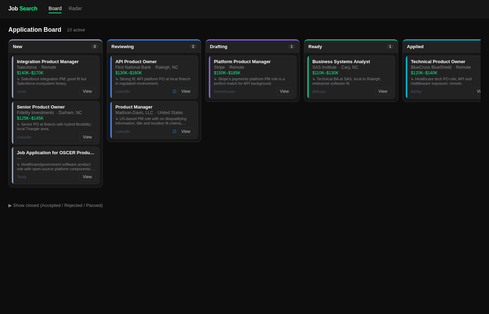
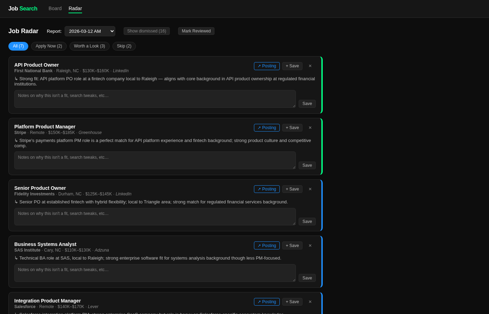
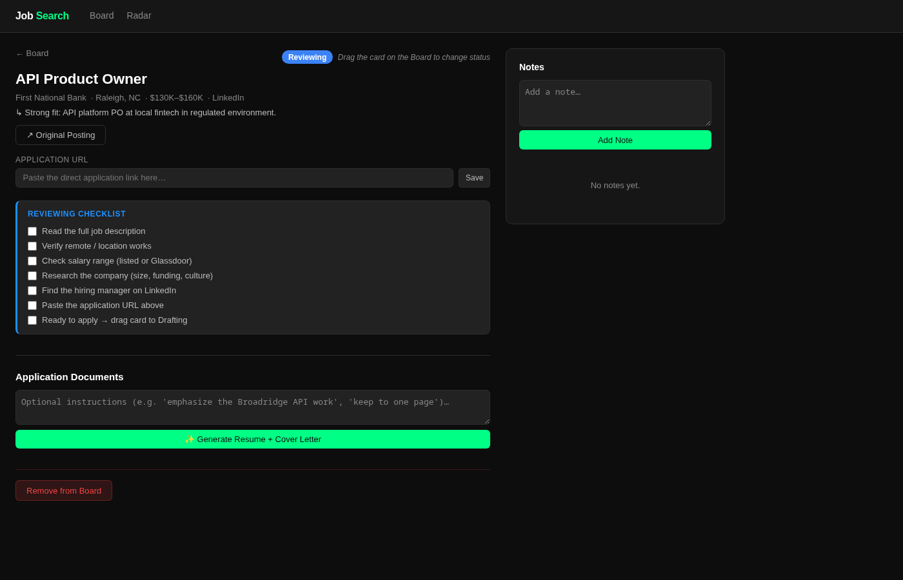

# Claude Code Job Search System

A Claude Code-powered job search system that runs automated daily searches across multiple job APIs, emails you results twice a day, and provides a full web dashboard for tracking applications and generating tailored resumes and cover letters.

Built and maintained using [Claude Code](https://claude.ai/code). Released under the [MIT License](LICENSE).

---

## Screenshots

**Kanban Board** — drag jobs through columns as you work them


**Job Radar** — tier-coded cards (green = Apply Now · blue = Worth a Look · gray = Skip)


**Job Detail** — reviewing checklist, application URL field, and document generation


---

## What It Does

**Automated Job Radar**
- Queries Adzuna, Brave Search, Tavily, LinkedIn, Remotive, WeWorkRemotely, Himalayas, RemoteOK, Jobicy, JSearch, Greenhouse, Lever, and Ashby ATS twice a day (9am and 4pm via cron)
- LinkedIn scraping uses full filter params (full-time, newest first, remote+hybrid), fetches up to 2 pages per query with randomized delays, and retrieves full job descriptions for every job that passes pre-filtering — so Claude rates on real content, not just title
- Deduplicates results across runs using multi-key dedup (company+title and URL) so you only see new postings
- Filters out wrong titles, non-US locations, onsite/hybrid roles outside your area, staffing agencies, closed listings, broken URLs, salary below floor, and aggregate/category pages
- Broad title targeting: PO, PM, BA, systems/functional/solutions/integration analyst, scrum master, agile delivery, platform/service/feature owner, pre-sales engineer, customer success (technical/enterprise), and more
- Rates each job with Claude Haiku — `Apply Now / Worth a Look / Weak Match / Skip` — with a one-sentence reason
- Within each tier, companies local to your configured metro area sort to the top — even for remote roles, proximity to the company is an advantage
- Saves a dated markdown report to `output/job-radar/` with each tier in its own section
- Emails the full report in the email body and attaches the `.md` file

**Web Dashboard** (`scripts/dashboard.py`)
- Local Flask app — neon dark UI, run it on your always-on machine, open at `http://localhost:5000`
- **Kanban board** — drag jobs through: New → Reviewing → Drafting → Ready → Applied → Phone Screen → Interview → Offer → Accepted / Rejected / Passed
  - Status is drag-only — no dropdowns to accidentally click
  - Reviewing cards show a checklist badge (☑) as a reminder to work through the checklist before moving on
- **Radar view** — browse reports in-browser, save jobs to the board with one click
  - Job cards have a color-coded right-border stripe: green = Apply Now, blue = Worth a Look, yellow = Weak Match, gray = Skip
  - Posting button is electric blue to distinguish it from the green Save button
  - Comment box on every card to note why a job isn't a fit or flag search tweaks
  - Dismiss jobs you've reviewed — stays hidden on future visits, toggle to show dismissed
  - Mark entire reports as reviewed — ✓ appears in the report dropdown
- **Job detail** — full description, timestamped notes, application URL field
  - Reviewing checklist: 7-step checklist (read JD, verify remote, check salary, research company, find hiring manager, paste apply URL, drag to Drafting) appears when card is in Reviewing
  - Paste and save a direct application URL — shows as a separate Apply Now button at the top
- **Document generation** — generates tailored resume + cover letter via Claude (uses your Pro subscription via `claude -p`, no API cost)
- **Two-panel editor** — edit resume and cover letter side by side, regenerate with custom instructions, version history, mark final
- **DOCX export** — download resume or cover letter as a Word file
- **SQLite database** — all jobs, notes, documents, comments, dismissed state, and application URLs persist locally

**Telegram Bot** (`scripts/telegram_bot.py`, optional)
- `/radar` — trigger a job search from your phone
- `/latest` — pull up the most recent report
- `/status` — last run summary
- Chat with any supported AI model using your full career profile as context
- Supports Claude, GPT-4o, Gemini, Kimi K2, DeepSeek, and any OpenRouter or Nvidia NIM model

---

## Repo Structure

```
job-search-profile/
├── CLAUDE.md                          # Claude Code instructions
├── .env                               # create locally — your API keys (gitignored)
├── config.py                          # create locally — copy from config.example.py (gitignored)
├── config.example.py                  # template — copy this to config.py to get started
├── docs/                              # create locally — your personal profile docs (gitignored)
│   ├── personal-info.md               # contact, headline, summary
│   ├── technical-skills.md            # master skills list
│   ├── education.md                   # degrees and formatting
│   ├── resume-generation-rules.md     # rules Claude follows for resume/cover letter work
│   ├── YYYY-YYYY-company-title.md     # one file per role
│   └── templates/                     # starter templates for each doc type
├── input/
│   ├── job-postings/                  # drop JDs here before generating a resume
│   ├── old-resumes/                   # source material for backfilling docs
│   └── raw-notes/                     # informal role notes to clean up
├── output/
│   ├── documents/                     # DOCX resume/cover letter exports
│   └── job-radar/                     # daily search reports + dedup state
├── dashboard/
│   ├── templates/                     # Jinja2 HTML templates
│   │   ├── base.html
│   │   ├── board.html
│   │   ├── radar.html
│   │   ├── job_detail.html
│   │   ├── draft.html
│   │   └── _card.html
│   └── static/
│       ├── style.css                  # dark mode UI
│       └── app.js
└── scripts/
    ├── job_radar.py                   # automated search, filter, rate, email
    ├── dashboard.py                   # Flask dashboard — kanban, radar, doc gen
    ├── telegram_bot.py                # Telegram bot with multi-model AI chat
    └── test_linkedin.py               # standalone LinkedIn scrape test + email
```

---

## Daily Workflow

**Job radar runs automatically.** Check your email at 9am and 4pm.

**Reviewing the radar:**
1. Open the dashboard at `http://localhost:5000` and go to **Radar**
2. Review each job — save promising ones to the board with **+ Save**, dismiss the rest with **✕**
3. Add comments to any job to note why it's not a fit (helps tune the search over time)
4. Click **Mark Reviewed** when done with the report

**Working a saved job:**
1. Go to **Board** — saved jobs land in the New column
2. Drag the card to **Reviewing** — a checklist (☑) badge appears as a reminder
3. Click **View** and work through the Reviewing checklist:
   - Read the full job description
   - Verify remote / location works
   - Check salary range (listed or Glassdoor)
   - Research the company (size, funding, culture)
   - Find the hiring manager on LinkedIn
   - Paste the application URL into the field and save
4. Drag the card to **Drafting**, then click **View** → **Generate Resume + Cover Letter**
5. Edit in the two-panel editor, add regeneration instructions if needed
6. Download DOCX, **Mark Final** — drag card to **Ready**
7. Move through Applied → Phone Screen → Interview → Offer as you progress

**To generate a resume without the dashboard:**
1. Save the job description to `input/job-postings/company-title.txt`
2. Open Claude Code in the repo and say: `generate resume for input/job-postings/company-title.txt`

---

## Setup

**Prerequisites:**
- [Claude Code](https://claude.ai/code) with a Pro or Max subscription
- Python 3.10+
- Free API keys: [Adzuna](https://developer.adzuna.com/) · [Brave Search](https://api.search.brave.com/) · [Tavily](https://tavily.com/)
- [Anthropic API key](https://console.anthropic.com/) — used for Claude Haiku job rating in `job_radar.py`
- Gmail account with an [App Password](https://myaccount.google.com/apppasswords)
- (Optional) Telegram bot token for mobile access

**Run the setup script** (handles deps, .env, config.py, docs, and cron for you):
```bash
python setup.py
```

Or set things up manually:

**Install dependencies:**
```bash
pip install flask python-docx anthropic openai google-genai requests beautifulsoup4 python-dotenv markdown
```

**Create your `.env` file:**
```
ANTHROPIC_API_KEY=...
ADZUNA_APP_ID=...
ADZUNA_API_KEY=...
BRAVE_API_KEY=...
TAVILY_API_KEY=...
JSEARCH_API_KEY=...         # optional
GMAIL_FROM=you@gmail.com
GMAIL_TO=you@gmail.com
GMAIL_APP_PW=...
TELEGRAM_BOT_TOKEN=...      # optional
TELEGRAM_USER_ID=...        # optional
```

**Configure for yourself:**
Copy `config.example.py` to `config.py` (gitignored) and fill it out:
```bash
cp config.example.py config.py
```
Key settings in `config.py`:
- `CANDIDATE_NAME`, `CANDIDATE_BACKGROUND` — your name and a short profile summary used for job rating
- `HOME_CITY`, `HOME_STATE`, `HOME_METRO_TERMS` — your location for local job filtering
- `JOB_DOCS` — list of your `docs/` job files for the dashboard
- Search query lists — `ADZUNA_QUERIES`, `LI_REMOTE_QUERIES`, `LI_LOCAL_QUERIES`, etc. — customize for your target roles
- `BLOCKED_COMPANIES` — add companies as you find ones that keep slipping through filters
- `DOMAIN_COMPANY_MAP` — add domains for better company name extraction from Workday/ATS URLs

**Run the dashboard:**
```bash
cd job-search-profile
python scripts/dashboard.py
# Open http://localhost:5000
```

**Schedule the radar (cron):**
```
0 9,16 * * 1-5 cd /path/to/job-search-profile && python scripts/job_radar.py
```

**Profile docs:**
Most setup time is writing your `docs/` files. Template files showing the expected structure for each doc type are in `docs/templates/`. Once those are solid, Claude can generate a tailored resume in under 2 minutes.
